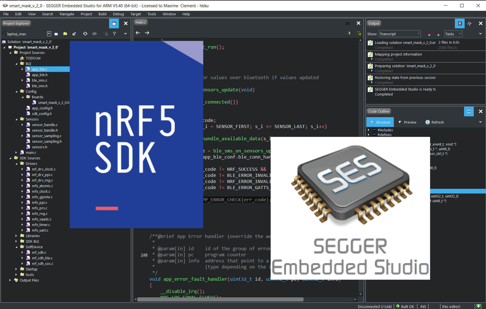

<p align="center"></p>

<p align="center" style="font-size:10em"><b>SMART MASK</b></p>

[](https://opensource.org/licenses/MIT)

# SMART MASK (Embedded System Firmware)
<br>
<p align="center">

</p>
<br>

# Description

<p  align="justify">
Embedded system firware written in C against Nordic's NRF SDK. This firmware allows for BLE central to connect. It enables to control and sample the 4 ADC (SAADC) connected to 4 printed sensors. Data are ring-buffered. The code has been developed on Segger Embedded Studio (successful compilations/programming have been made with GNU ARM on earlier versions).
</p>

# Features

Bluetooth BLE <br>
Controllable Gain (over BLE) <br>
Controllable Sampling Frequency (over BLE) <br>
Automatic Re-pairing <br>
Watchdog reset <br>

# Getting Started Instructions

Embedded C project for the NRF52 of Nordic

Use nordic NRF5 SDK 
Developped with Segger Embedded Studio (on Windows 10)

Instructions:
- Download Nordic NRF5 SDK version 15.3.0 (important)
- Download Segger Embedded Studio (latest version)
- Clone the project
- Navigate to : smart_mask/Embedded_system/ble_mask/project/ses/ 
- Open " on any text editor
- At the bottom of the file, add a configuration (before "</solution>") such as this one bellow

```xml
    <configuration
        Name="theNameYouWant"
        c_preprocessor_definitions="DEBUG; DEBUG_NRF"
        gcc_optimization_level="None"
        macros="NRF_SDK=C:/absolute/path/to/your/sdk;PROJ_ROOT=C:/absolute/path/to/your/the/ble_smart_mask/folder" />
```

- Modify "Name" to your need

- In "macros":
    - Add the path to your nrf sdk you downloaded replace: C:/absolute/path/to/your/sdk
    - Add the path to "ble_smart_mask" folder in this repo. replace: C:/absolute/path/to/your/the/ble_smart_mask/folder
    - Use forward slashes "/" and absolute path (it' easier)

- Open segger embedded studio

- File -> open Solution -> navigate to "ble_mask.emProject"

- In project explorer, select the configuration you added (or go to Build -> Configurations.. and select your)

- Build -> Build ble_mask

- You can also delete the configurations you don't need

<br>

# Roadmap
- Sleep mode
- different sample frequency per sensor
- Over the air firmware update
- Data link encryption (bluetooth bonding)
- Bluetooth reset