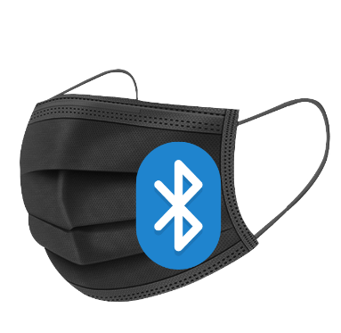
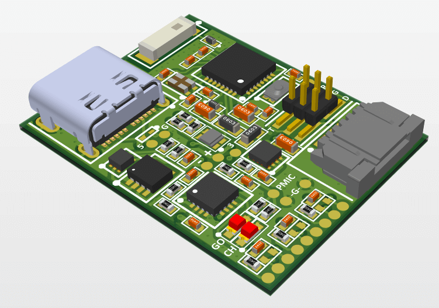

# FlexySense Mask (PCB Cad files)
 

 
 
mask_v_2_0 PCB on Altium Designer

 

# Description

PCB board designed with Altium Designer for the FlexySense Mask project. All components used are from custom <a href="https://github.com/pseudoincorrect/Altium_Libraries">Altium_Libraries</a>. Latest version includes a 4 layers PCB.

# Features (Latest Version)

Battery management and protection  
Bluetooth Chip with chip antenna  
Buck Regualator  
FFC connectors for the sensors 
USB C for charging 
Pairing Button and LED  

# Notes
Altium version above (or equal) to 18.0 is prefered to work on this project.

# PCB Properties (Latest Version)

Dimensions (mm): 22 * 29

4 layers:
- (1) Signal/GND   
- (2) GND   
- (3) Power   
- (4) Signal/GND
 

Clearance: 6 mils

#