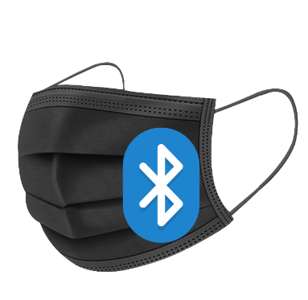
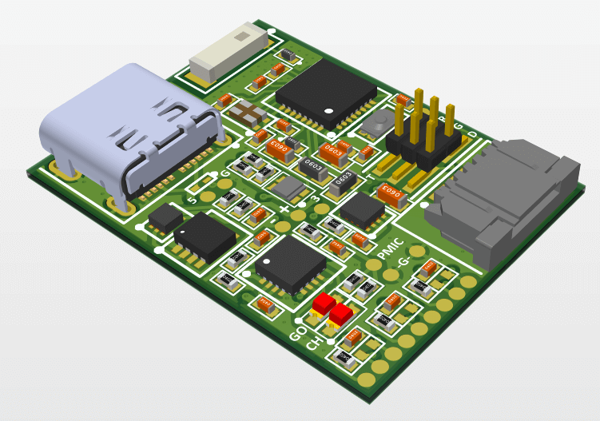

 
FlexySense Mask is an embedded system connected to a mobile app to monitor the outputs of our custom printed sensors.

This System is divided into 3 parts:
- A Printed Circuit Board (PCB) for the embedded system, made with Altium Designer
- An embedded system firmware, written in C (Nordic SDK)
- A Flutter mobile application, for bluetooth connection, data storage and presentation

 

&nbsp;&nbsp;&nbsp;------&nbsp;&nbsp;&nbsp;

&nbsp;&nbsp;&nbsp;------&nbsp;&nbsp;&nbsp;

 

# Printed Circuit Board

The PCB is developped with Altium (started initially with Cadsoft Eagle). 
Sources and supportind documents are in  <a href="https://github.com/pseudoincorrect/smart_mask/tree/master/PCB">PCB/</a>.

 

&nbsp;&nbsp;&nbsp;------&nbsp;&nbsp;&nbsp;

 

# Mobile Application

The Mobile app is developped with the Flutter SDK. 
Gather data and control the embedded system through bluetooth.  
Store on local Db and display. Filter and navigate data through analytic page   
Sources and supportind documents are in <a href="https://github.com/pseudoincorrect/smart_mask/tree/master/Mobile_app/smart_mask">Mobile_app/</a>.

 

 

# Embedded System Software

Firmware for the central chip, a nrf52810 from Nordic Semiconductors.  The program is being developped with Nordic SDK on Segger Embedded Studio.  
Sources and supportind documents are in <a href="https://github.com/pseudoincorrect/smart_mask/tree/master/Embedded_system/smart_mask">Embedded_system/</a>.

 

 
 

## Versatility
This project is quite general in the use of the sensor and can be adapted to any bluetooth sensor combined with mobile app. In such case, forking this repository and adapting to a new solution would be a wise strategy.
 

## Remarks
CAD files, embedded software and app are usually separated in different repositories.  
Here as the project is still simple enough and self-contained, all parts are kepts together.
 
